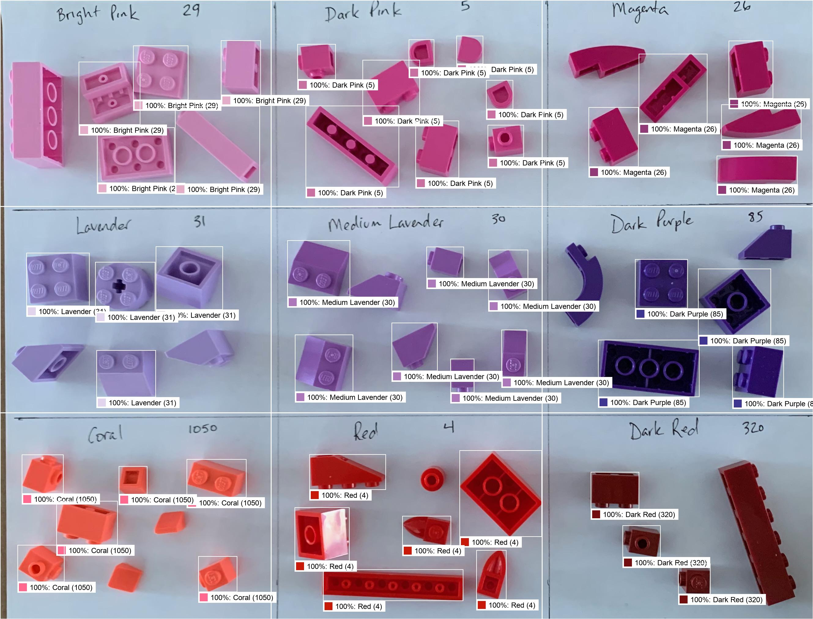

# Lego Color Classification Model



## Dataset

* 42 colors, including most/all of the common colors
* real photos on white printer paper
* labeled with Rebrickable.com color ids
* high confidence they are tagged correctly
  * parts are from two mostly pristine sets
  * most colors have some unique parts so I am confident that are labeled correctly
  * [10713-1 Creative Suitcase](https://rebrickable.com/sets/10713-1/creative-suitcase/#parts)
  * [11011-1 Bricks and Animals](https://rebrickable.com/sets/11011-1/bricks-and-animals/?inventory=1#parts)

Stats
```
Class:  # Train   # Val   Total
------  -------   -----   -----
0    :      261      64     325
1    :      195      51     246
2    :      237      53     290
3    :      197      54     251
4    :      316      77     393
5    :      207      54     261
10   :      313      86     399
14   :      239      64     303
15   :      305      73     378
19   :      199      49     248
25   :      273      67     340
26   :      135      25     160
27   :      292      71     363
28   :      239      56     295
29   :      243      67     310
30   :      227      57     284
31   :      170      50     220
41   :      192      44     236
46   :      113      22     135
47   :      104      25     129
70   :      169      49     218
71   :      209      51     260
72   :      210      48     258
73   :      336      75     411
84   :      144      23     167
85   :      197      58     255
158  :      102      27     129
182  :       37      10      47
191  :      253      58     311
212  :      200      50     250
226  :      243      83     326
272  :      255      63     318
288  :      299      79     378
308  :       91      22     113
320  :      185      49     234
321  :      223      46     269
322  :      204      54     258
323  :      110      22     132
326  :      312      58     370
378  :       39      14      53
484  :      168      29     197
1050 :      205      58     263
------  -------   -----   -----
Total      8648    2135   10783
```

## Future

* more colors
* vary the background
* printed parts


## Do it yourself

```
# gather source data
# take sheet of white US letter paper
# divide into 9 cells
# assign each cell a color
# optionally label each cell with a pen
# put lego pieces matching the color into the cells, do not overlap piecs, do not overlap cell boundaries (give yourself some margin)
# take a photo, move a little ways away to minimize fisheye
# crop/rotate photo to just the sheet of paper
# put into ./src/images and include the Rebrickable Color IDs in the filename separated by dashes, left-to-right, top-to-bottom
#   e.g. whatever-you-want.1-2-3-4-5-6-7-8-9.png

# generate dataset (see intermediate output in ./tmp)
python dataset.py

# optionally get on Paperspace.com
aws s3 cp datasets/lego-color-common-5k-dataset-4-baseline-plus-renders.zip s3://brian-lego-public/lego-color/
wget https://brian-lego-public.s3.us-west-1.amazonaws.com/lego-color/lego-color-common-5k-dataset-4-baseline-plus-renders.zip

# train
python train.py
```
